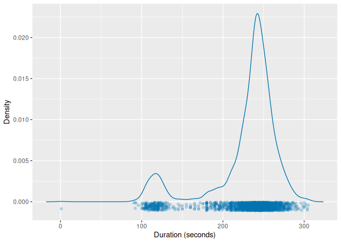
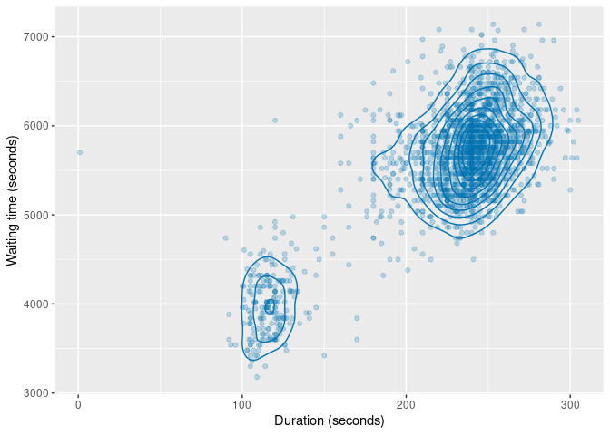
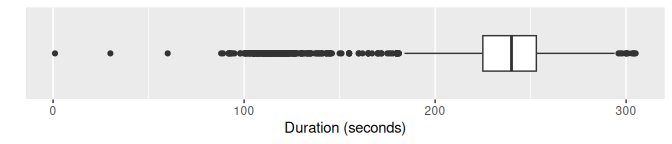
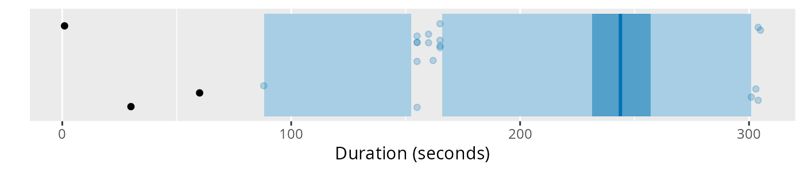
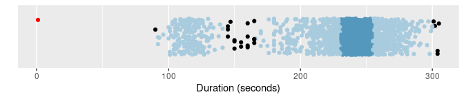
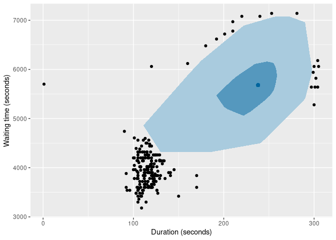
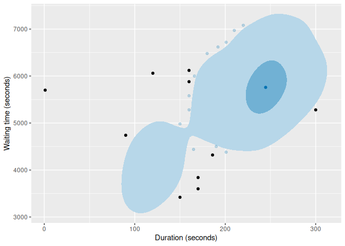
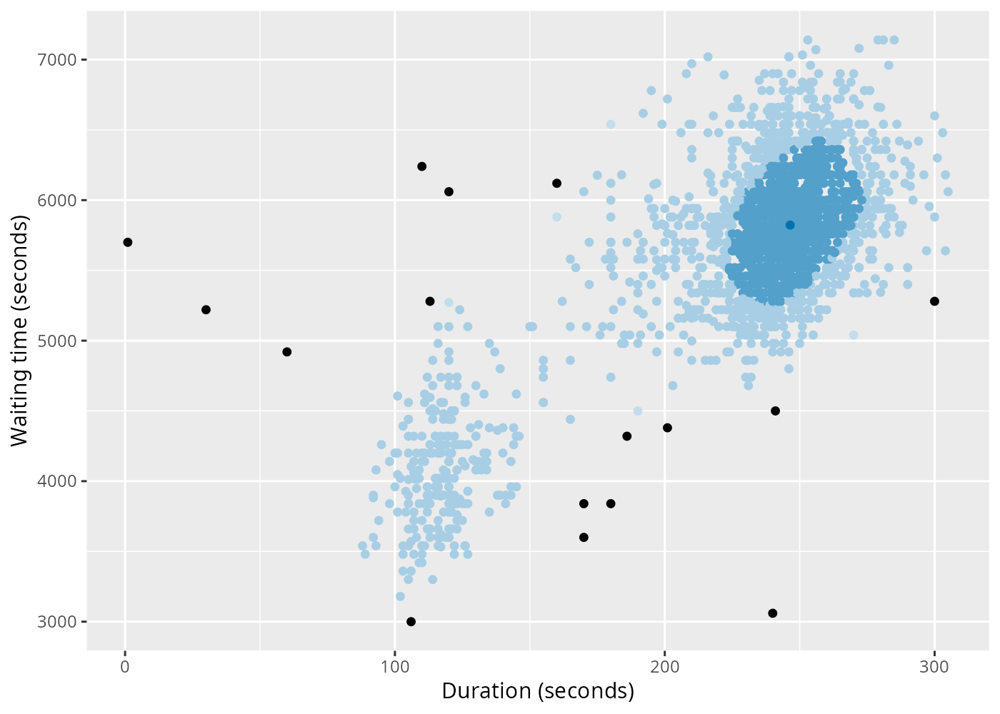

<!-- README.md is generated from README.qmd. Please edit that file -->

# weird 

<!-- badges: start -->

[](https://github.com/robjhyndman/weird-package/actions)
<!-- badges: end -->

## Overview

The weird package contains functions and data used in the book [*That’s
Weird: Anomaly Detection Using R*](https://OTexts.com/weird/) by Rob J
Hyndman. It also loads several packages needed to do the analysis
described in the book.

## Installation

You can install the **stable** version from
[CRAN](https://cran.r-project.org/package=weird) with:

``` r
install.packages("weird")
```

You can install the **development** version of weird from
[GitHub](https://github.com/robjhyndman/weird-package) with:

``` r
# install.packages("devtools")
devtools::install_github("robjhyndman/weird-package")
```

## Usage

`library(weird)` will load the following packages:

- [dplyr](https://dplyr.tidyverse.org), for data manipulation.
- [ggplot2](https://ggplot2.tidyverse.org), for data visualisation.
- [distributional](https://cran.r-project.org/package=distributional),
  for handling probability distributions.

You also get a condensed summary of conflicts with other packages you
have loaded:

``` r
library(weird)
#> ── Attaching packages ────────────────────────────────────────────────────────── weird 1.0.2.9000 ──
#> ✔ dplyr          1.1.4     ✔ distributional 0.5.0
#> ✔ ggplot2        3.5.1
#> ── Conflicts ──────────────────────────────────────────────────────────────────── weird_conflicts ──
#> ✖ dplyr::filter() masks stats::filter()
#> ✖ dplyr::lag()    masks stats::lag()
```

## Example: Old Faithful Geyser data

The `oldfaithful` data set contains eruption data from the Old Faithful
Geyser in Yellowstone National Park, Wyoming, USA, from 1 January 2015
to 1 October 2021. The data were obtained from the
[geysertimes.org](https://geysertimes.org) website. Recordings are
incomplete, especially during the winter months when observers may not
be present. There also appear to be some recording errors. The data set
contains 2261 observations of 3 variables: `time` giving the time at
which each eruption began, `duration` giving the length of the eruption
in seconds, and `waiting` giving the time to the next eruption in
seconds. In the analysis below, we omit the eruption with `duration`
greater than 1 hour as this is likely to be a recording error. Some of
the long `waiting` values are probably due to omitted eruptions, and so
we also omit eruptions with `waiting` greater than 2 hours.

``` r
oldfaithful
#> # A tibble: 2,261 × 3
#>    time                duration waiting
#>    <dttm>                 <dbl>   <dbl>
#>  1 2015-01-02 14:53:00      271    5040
#>  2 2015-01-09 23:55:00      247    6060
#>  3 2015-02-07 00:49:00      203    5460
#>  4 2015-02-14 01:09:00      195    5221
#>  5 2015-02-21 01:12:00      210    5401
#>  6 2015-02-28 01:11:00      185    5520
#>  7 2015-03-07 00:50:00      160    5281
#>  8 2015-03-13 21:57:00      226    6000
#>  9 2015-03-13 23:37:00      190    5341
#> 10 2015-03-20 22:26:00      102    3961
#> # ℹ 2,251 more rows
```

## Kernel density estimates

The package provides the `kde_bandwidth()` function for estimating the
bandwidth of a kernel density estimate, `dist_kde()` for constructing
the distribution, and `gg_density()` for plotting the resulting density.
The figure below shows the kernel density estimate of the `duration`
variable obtained using these functions.

``` r
of <- oldfaithful |>
  filter(duration < 3600, waiting < 7200)
dist_kde(of$duration) |>
  gg_density(show_points = TRUE, jitter = TRUE) +
  labs(x = "Duration (seconds)")
```



The same functions also work with bivariate data. The figure below shows
the kernel density estimate of the `duration` and `waiting` variables.

``` r
of |>
  select(duration, waiting) |>
  dist_kde() |>
  gg_density(show_points = TRUE, alpha = 0.15) +
  labs(x = "Duration (seconds)", y = "Waiting time (seconds)")
```



## Statistical tests

Some old methods of anomaly detection used statistical tests. While
these are not recommended, they are still widely used, and are provided
in the package for comparison purposes.

``` r
of |> filter(peirce_anomalies(duration))
#> # A tibble: 1 × 3
#>   time                duration waiting
#>   <dttm>                 <dbl>   <dbl>
#> 1 2018-04-25 19:08:00        1    5700
of |> filter(chauvenet_anomalies(duration))
#> # A tibble: 1 × 3
#>   time                duration waiting
#>   <dttm>                 <dbl>   <dbl>
#> 1 2018-04-25 19:08:00        1    5700
of |> filter(grubbs_anomalies(duration))
#> # A tibble: 1 × 3
#>   time                duration waiting
#>   <dttm>                 <dbl>   <dbl>
#> 1 2018-04-25 19:08:00        1    5700
of |> filter(dixon_anomalies(duration))
#> # A tibble: 1 × 3
#>   time                duration waiting
#>   <dttm>                 <dbl>   <dbl>
#> 1 2018-04-25 19:08:00        1    5700
```

In this example, they only detect the tiny 1-second duration, which is
almost certainly a recording error. An explanation of these tests is
provided in [Chapter 4 of the
book](https://otexts.com/weird/04-tests.html)

## Boxplots

Boxplots are widely used for anomaly detection. Here are three
variations of boxplots applied to the `duration` variable.

``` r
of |>
  ggplot(aes(x = duration)) +
  geom_boxplot() +
  scale_y_discrete() +
  labs(y = "", x = "Duration (seconds)")
```



``` r
of |> gg_hdrboxplot(duration) +
  labs(x = "Duration (seconds)")
```



``` r
of |> gg_hdrboxplot(duration, show_points = TRUE) +
  labs(x = "Duration (seconds)")
```



The latter two plots are highest density region (HDR) boxplots, which
allow the bimodality of the data to be seen. The dark shaded region
contains 50% of the observations, while the lighter shaded region
contains 99% of the observations. The plots use vertical jittering to
reduce overplotting, and highlight potential outliers (those points
lying outside the 99% HDR). An explanation of these plots is provided in
[Chapter 5 of the book](https://otexts.com/weird/05-boxplots.html).

It is also possible to produce bivariate boxplots. Several variations
are provided in the package. Here are two types of bagplot.

``` r
of |>
  gg_bagplot(duration, waiting) +
  labs(x = "Duration (seconds)", y = "Waiting time (seconds)")
```



``` r
of |>
  gg_bagplot(duration, waiting, scatterplot = TRUE) +
  labs(x = "Duration (seconds)", y = "Waiting time (seconds)")
```


And here are two types of HDR boxplot

``` r
of |>
  gg_hdrboxplot(duration, waiting) +
  labs(x = "Duration (seconds)", y = "Waiting time (seconds)")
```



``` r
of |>
  gg_hdrboxplot(duration, waiting, scatterplot = TRUE) +
  labs(x = "Duration (seconds)", y = "Waiting time (seconds)")
```



The latter two plots show possible outliers in black (again, defined as
points outside the 99% HDR).

## Scoring functions

Several functions are provided for providing anomaly scores for all
observations.

- The `surprisals()` function uses either a fitted statistical model, or
  a kernel density estimate, to compute density scores.
- The `stray_scores()` function uses the stray algorithm to compute
  anomaly scores.
- The `lof_scores()` function uses local outlier factors to compute
  anomaly scores.
- The `glosh_scores()` function uses the Global-Local Outlier Score from
  Hierarchies algorithm to compute anomaly scores.
- The `lookout_prob()` function uses the lookout algorithm of
  [Kandanaarachchi & Hyndman
  (2022)](https://robjhyndman.com/publications/lookout/) to compute
  anomaly probabilities.

Here are the top 0.02% most anomalous observations identified by each of
the methods.

``` r
of |>
  mutate(
    surprisal = surprisals(cbind(duration, waiting), probability = FALSE),
    strayscore = stray_scores(cbind(duration, waiting)),
    lofscore = lof_scores(cbind(duration, waiting), k = 150),
    gloshscore = glosh_scores(cbind(duration, waiting)),
    lookout = lookout_prob(cbind(duration, waiting))
  ) |>
  filter(
    surprisal > quantile(surprisal, prob = 0.998) |
      strayscore > quantile(strayscore, prob = 0.998) |
      lofscore > quantile(lofscore, prob = 0.998) |
      gloshscore > quantile(gloshscore, prob = 0.998) |
      lookout < 0.002
  ) |>
  arrange(lookout)
#> # A tibble: 10 × 8
#>    time                duration waiting surprisal strayscore lofscore gloshscore  lookout
#>    <dttm>                 <dbl>   <dbl>     <dbl>      <dbl>    <dbl>      <dbl>    <dbl>
#>  1 2018-04-25 19:08:00        1    5700      17.9     0.380      3.78      1     0       
#>  2 2020-06-01 21:04:00      120    6060      17.8     0.132      1.88      1     3.99e-10
#>  3 2021-01-22 18:35:00      170    3600      16.9     0.0606     1.09      0.860 4.83e- 5
#>  4 2020-08-31 09:56:00      170    3840      16.7     0.0606     1.01      0.816 4.11e- 4
#>  5 2015-11-21 20:27:00      150    3420      16.2     0.0772     1.27      1     4.10e- 3
#>  6 2020-10-15 17:11:00      220    7080      15.7     0.0429     2.42      1     3.46e- 2
#>  7 2017-08-12 13:14:00      120    4920      15.0     0.0690     1.53      1     1.42e- 1
#>  8 2017-09-22 18:51:00      281    7140      15.0     0.0333     2.64      1     1.81e- 1
#>  9 2020-05-18 21:21:00      272    7080      14.5     0.0333     2.42      1     4.02e- 1
#> 10 2018-09-22 16:37:00      253    7140      14.6     0.0200     2.63      1     4.05e- 1
```

The `surprisals()` function can also compute the probability of
obtaining surprisal values at least as extreme as those observed. In
fact, this is the default behaviour, obtained when `probability = TRUE`.

``` r
of |>
  mutate(
    surprisal = surprisals(cbind(duration, waiting), probability = FALSE),
    prob = surprisals(cbind(duration, waiting))
  ) |>
  arrange(prob)
#> # A tibble: 2,197 × 5
#>    time                duration waiting surprisal     prob
#>    <dttm>                 <dbl>   <dbl>     <dbl>    <dbl>
#>  1 2018-04-25 19:08:00        1    5700      17.9 0.000455
#>  2 2020-06-01 21:04:00      120    6060      17.8 0.000910
#>  3 2021-01-22 18:35:00      170    3600      16.9 0.00137 
#>  4 2020-08-31 09:56:00      170    3840      16.7 0.00182 
#>  5 2015-11-21 20:27:00      150    3420      16.2 0.00228 
#>  6 2017-05-03 06:19:00       90    4740      16.2 0.00273 
#>  7 2020-09-16 14:44:00      160    6120      16.1 0.00319 
#>  8 2020-07-23 23:17:00      186    4320      16.1 0.00364 
#>  9 2019-07-25 06:32:00      300    5280      15.9 0.00410 
#> 10 2020-09-15 18:01:00      160    5880      15.9 0.00455 
#> # ℹ 2,187 more rows
```

## Robust multivariate scaling

Some anomaly detection methods require the data to be scaled first, so
all observations are on the same scale. However, many scaling methods
are not robust to anomalies. The `mvscale()` function provides a
multivariate robust scaling method, that optionally takes account of the
relationships betwen variables, and uses robust estimates of center,
scale and covariance by default. The centers are removed using medians,
the scale function is the IQR, and the covariance matrix is estimated
using a robust OGK estimate. The data are scaled using the Cholesky
decomposition of the inverse covariance. Then the scaled data are
returned. The scaled variables are rotated to be orthogonal, so are
renamed as `z1`, `z2`, etc. Non-rotated scaling is possible by setting
`cov = NULL`.

``` r
mvscale(of)
#> Warning in mvscale(of): Ignoring non-numeric columns: time
#> # A tibble: 2,197 × 3
#>    time                     z1     z2
#>    <dttm>                <dbl>  <dbl>
#>  1 2015-01-02 14:53:00  2.02   -1.33 
#>  2 2015-01-09 23:55:00  0.0758  0.728
#>  3 2015-02-07 00:49:00 -1.64   -0.485
#>  4 2015-02-14 01:09:00 -1.86   -0.968
#>  5 2015-02-21 01:12:00 -1.25   -0.604
#>  6 2015-02-28 01:11:00 -2.57   -0.364
#>  7 2015-03-07 00:50:00 -3.63   -0.847
#>  8 2015-03-13 21:57:00 -0.913   0.606
#>  9 2015-03-13 23:37:00 -2.19   -0.726
#> 10 2015-03-20 22:26:00 -5.50   -3.51 
#> # ℹ 2,187 more rows
mvscale(of, cov = NULL)
#> Warning in mvscale(of, cov = NULL): Ignoring non-numeric columns: time
#> # A tibble: 2,197 × 3
#>    time                duration waiting
#>    <dttm>                 <dbl>   <dbl>
#>  1 2015-01-02 14:53:00    1.40   -1.24 
#>  2 2015-01-09 23:55:00    0.316   0.676
#>  3 2015-02-07 00:49:00   -1.67   -0.451
#>  4 2015-02-14 01:09:00   -2.03   -0.900
#>  5 2015-02-21 01:12:00   -1.35   -0.562
#>  6 2015-02-28 01:11:00   -2.48   -0.338
#>  7 2015-03-07 00:50:00   -3.61   -0.787
#>  8 2015-03-13 21:57:00   -0.631   0.564
#>  9 2015-03-13 23:37:00   -2.25   -0.675
#> 10 2015-03-20 22:26:00   -6.22   -3.27 
#> # ℹ 2,187 more rows
```
