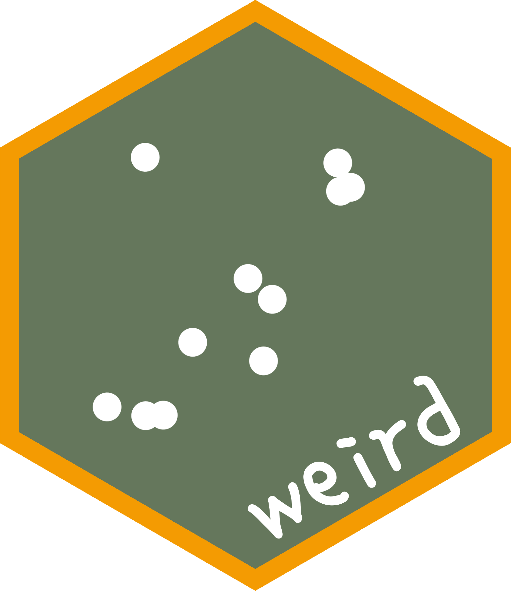

<!-- README.md is generated from README.qmd. Please edit that file -->

```{r}
#| include: false

knitr::opts_chunk$set(
  collapse = TRUE,
  comment = "#>",
  fig.path = "man/figures/README-",
  out.width = "100%",
  dev = "ragg_png",
  dpi = 200
)
options(width = 85)
set.seed(1967)
# Fira Sans font for graphics
ggplot2::theme_set(
  ggplot2::theme_get() +
    ggplot2::theme(text = ggplot2::element_text(family = "Fira Sans"))
)
```

# weird  

<!-- badges: start -->
[](https://github.com/robjhyndman/weird/actions/workflows/R-CMD-check.yaml)
[](https://CRAN.R-project.org/package=weird)
[](https://cran.r-project.org/package=weird)
[](https://www.gnu.org/licenses/gpl-3.0.en.html)
<!-- badges: end -->

## Overview

The weird package contains functions and data used in the book [*That's Weird: Anomaly Detection Using R*](https://OTexts.com/weird/) by Rob J Hyndman. It also loads several packages needed to do the analysis described in the book.

## Installation

You can install the **stable** version from [CRAN](https://cran.r-project.org/package=weird) with:

```r
install.packages("weird")
```

You can install the **development** version of weird from [GitHub](https://github.com/robjhyndman/weird) with:

```r
# install.packages("pak")
pak::pak("robjhyndman/weird")
```

## Usage

`library(weird)` will also load the following packages:

- [dplyr](https://dplyr.tidyverse.org), for data manipulation.
- [ggplot2](https://ggplot2.tidyverse.org), for data visualisation.
- [distributional](https://cran.r-project.org/package=distributional), for handling probability distributions.

When you load the weird package, you get a condensed summary of conflicts with other packages you have previously loaded:

```{r}
#| label: usage

library(weird)
```
