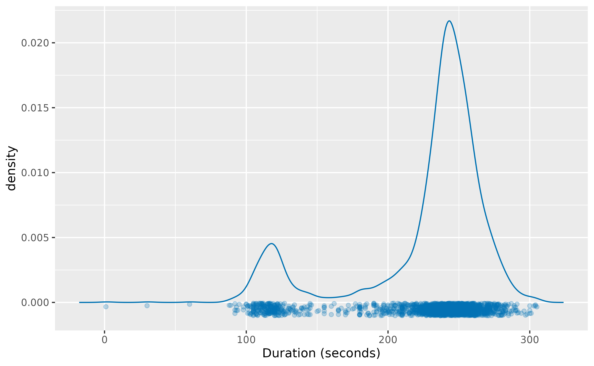
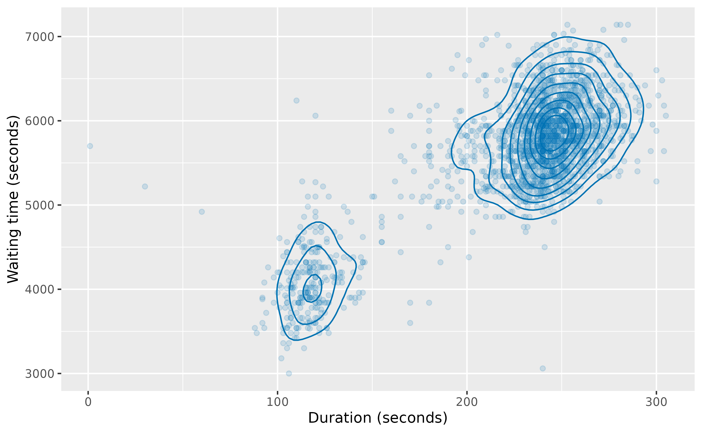
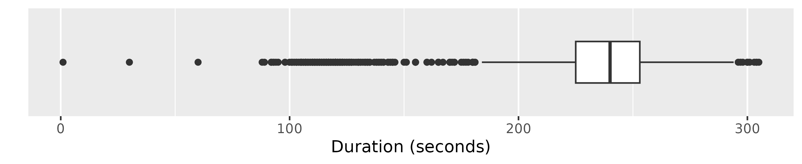
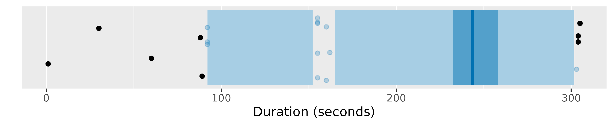
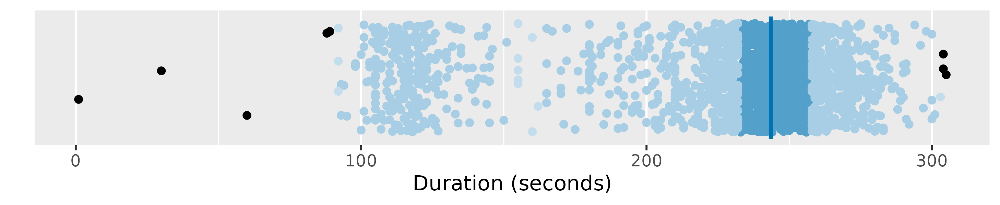
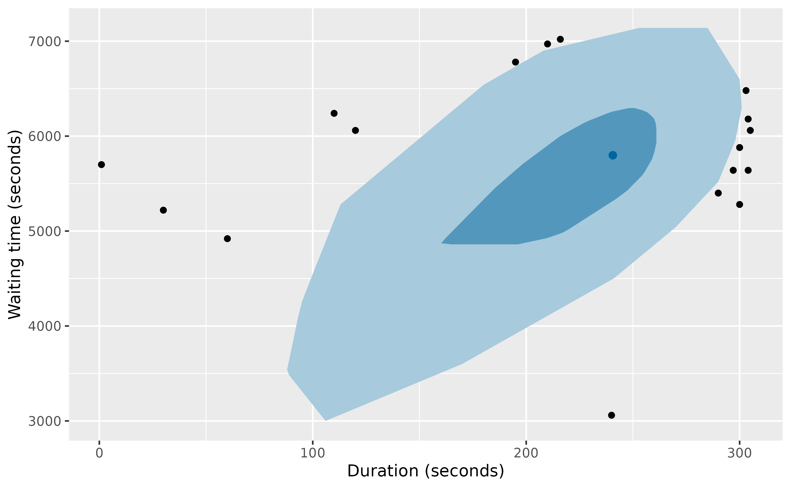
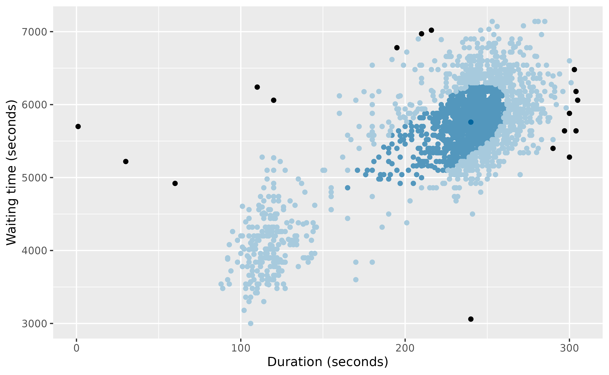
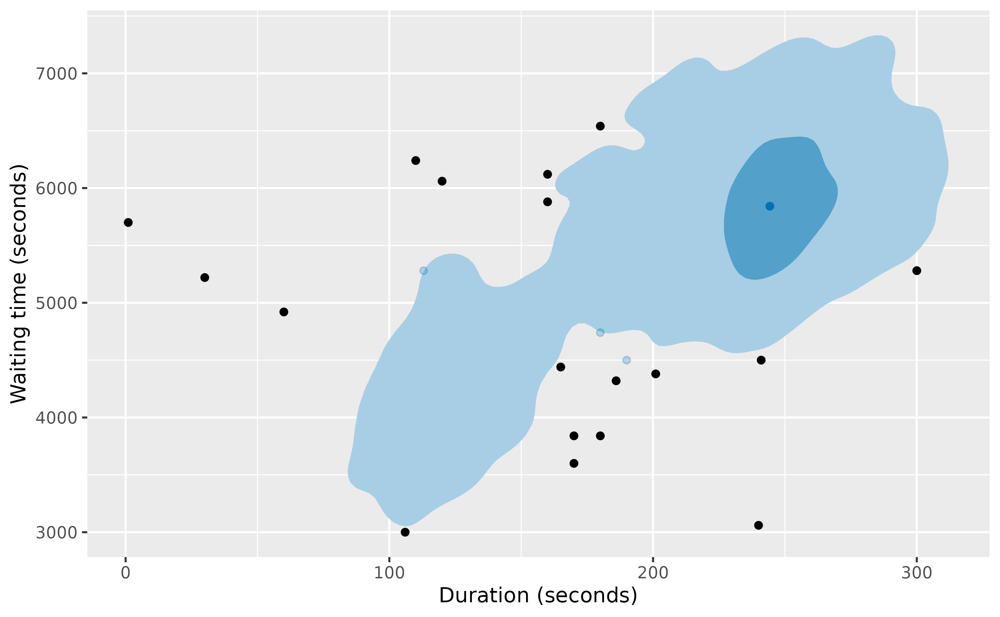
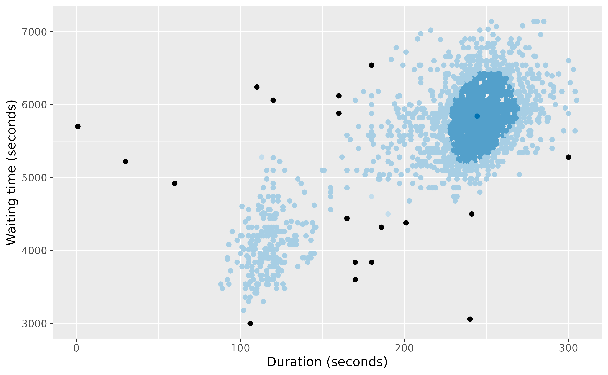

# Old Faithful Geyser example

``` r

library(weird)
#> Warning: no DISPLAY variable so Tk is not available
#> ── Attaching core weird packages ──────────────────────────────── weird 3.0.0.9000 ──
#> ✔ distributional 0.8.1     ✔ ggplot2        4.0.3
#> ✔ dplyr          1.2.1
#> ── Conflicts ───────────────────────────────────────────────────── weird_conflicts ──
#> ✖ dplyr::filter() masks stats::filter()
#> ✖ dplyr::lag()    masks stats::lag()
```

The `oldfaithful` data set contains eruption data from the Old Faithful
Geyser in Yellowstone National Park, Wyoming, USA, from 2017 to 2023.
The data were obtained from the
[geysertimes.org](https://geysertimes.org) website. Recordings are
incomplete, especially during the winter months when observers may not
be present. There also appear to be some recording errors. The data set
contains 2097 observations of 3 variables: `time` giving the time at
which each eruption began, `recorded_duration` giving the length of the
eruption as recorded, `duration` giving the length of the eruption in
seconds, and `waiting` giving the time to the next eruption in seconds.

``` r

oldfaithful
#> # A tibble: 2,097 × 4
#>    time                recorded_duration duration waiting
#>    <dttm>              <chr>                <dbl>   <dbl>
#>  1 2017-01-14 00:06:00 3m 16s                 196    5940
#>  2 2017-01-26 14:27:00 ~4m                    240    5820
#>  3 2017-01-27 23:57:00 2m 1s                  121    3900
#>  4 2017-01-30 15:09:00 ~4m                    240    5280
#>  5 2017-01-31 13:27:00 ~3.5m                  210    5580
#>  6 2017-01-31 15:00:00 ~4m                    240    5760
#>  7 2017-02-03 23:13:00 3m 25s                 205    5160
#>  8 2017-02-04 22:14:00 3m 34s                 214    5400
#>  9 2017-02-05 17:19:00 4m 0s                  240    6060
#> 10 2017-02-05 19:00:00 4m 2s                  242    6060
#> # ℹ 2,087 more rows
```

## Kernel density estimates

The package provides the
[`kde_bandwidth()`](https://pkg.robjhyndman.com/weird/reference/kde_bandwidth.md)
function for estimating the bandwidth of a kernel density estimate,
[`dist_kde()`](https://pkg.robjhyndman.com/weird/reference/dist_kde.md)
for constructing the distribution, and
[`gg_density()`](https://pkg.robjhyndman.com/weird/reference/gg_density.md)
for plotting the resulting density. The figure below shows the kernel
density estimate of the `duration` variable obtained using these
functions.

``` r

dist_kde(oldfaithful$duration) |>
  gg_density(show_points = TRUE, jitter = TRUE) +
  labs(x = "Duration (seconds)")
```



The same functions also work with bivariate data. The figure below shows
the kernel density estimate of the `duration` and `waiting` variables.

``` r

oldfaithful |>
  select(duration, waiting) |>
  dist_kde() |>
  gg_density(show_points = TRUE, alpha = 0.15) +
  labs(x = "Duration (seconds)", y = "Waiting time (seconds)")
```



## Statistical tests

Some old methods of anomaly detection used statistical tests. While
these are not recommended, they are still widely used, and are provided
in the package for comparison purposes.

``` r

oldfaithful |> filter(peirce_anomalies(duration))
#> # A tibble: 2 × 4
#>   time                recorded_duration duration waiting
#>   <dttm>              <chr>                <dbl>   <dbl>
#> 1 2018-04-25 19:08:00 1s                       1    5700
#> 2 2022-12-07 17:19:00 ~4 30s                  30    5220
oldfaithful |> filter(chauvenet_anomalies(duration))
#> # A tibble: 2 × 4
#>   time                recorded_duration duration waiting
#>   <dttm>              <chr>                <dbl>   <dbl>
#> 1 2018-04-25 19:08:00 1s                       1    5700
#> 2 2022-12-07 17:19:00 ~4 30s                  30    5220
oldfaithful |> filter(grubbs_anomalies(duration))
#> # A tibble: 1 × 4
#>   time                recorded_duration duration waiting
#>   <dttm>              <chr>                <dbl>   <dbl>
#> 1 2018-04-25 19:08:00 1s                       1    5700
oldfaithful |> filter(dixon_anomalies(duration))
#> # A tibble: 0 × 4
#> # ℹ 4 variables: time <dttm>, recorded_duration <chr>, duration <dbl>, waiting <dbl>
```

There are at least three anomalies in this example (due to recording
errors), but none of these methods detect them all. An explanation of
these tests is provided in [Chapter 4 of the
book](https://OTexts.com/weird/04-tests.html)

## Boxplots

Boxplots are widely used for anomaly detection. Here are three
variations of boxplots applied to the `duration` variable.

``` r

oldfaithful |>
  ggplot(aes(x = duration)) +
  geom_boxplot() +
  scale_y_discrete() +
  labs(y = "", x = "Duration (seconds)")
```



``` r

oldfaithful |> gg_hdrboxplot(duration) + labs(x = "Duration (seconds)")
```



``` r

oldfaithful |>
  gg_hdrboxplot(duration, show_points = TRUE) +
  labs(x = "Duration (seconds)")
```



The latter two plots are highest density region (HDR) boxplots, which
allow the bimodality of the data to be seen. The dark shaded region
contains 50% of the observations, while the lighter shaded region
contains 99% of the observations. The plots use vertical jittering to
reduce overplotting, and highlight potential outliers (those points
lying outside the 99% HDR which have surprisal probability less than
0.0005). An explanation of these plots is provided in [Chapter 5 of the
book](https://OTexts.com/weird/05-boxplots.html).

It is also possible to produce bivariate boxplots. Several variations
are provided in the package. Here are two types of bagplot.

``` r

oldfaithful |>
  gg_bagplot(duration, waiting) +
  labs(x = "Duration (seconds)", y = "Waiting time (seconds)")
```



``` r

oldfaithful |>
  gg_bagplot(duration, waiting, show_points = TRUE) +
  labs(x = "Duration (seconds)", y = "Waiting time (seconds)")
```



And here are two types of HDR boxplot

``` r

oldfaithful |>
  gg_hdrboxplot(duration, waiting) +
  labs(x = "Duration (seconds)", y = "Waiting time (seconds)")
```



``` r

oldfaithful |>
  gg_hdrboxplot(duration, waiting, show_points = TRUE) +
  labs(x = "Duration (seconds)", y = "Waiting time (seconds)")
```



The latter two plots show possible outliers in black (again, defined as
points outside the 99% HDR which have surprisal probability less than
0.0005).

## Scoring functions

Several functions are provided for providing anomaly scores for all
observations.

- The
  [`surprisals()`](https://pkg.robjhyndman.com/weird/reference/surprisals.md)
  function uses either a fitted statistical model, or a kernel density
  estimate, to compute surprisals.
- The
  [`surprisals_prob()`](https://pkg.robjhyndman.com/weird/reference/surprisals.md)
  function computes the probability of obtaining surprisal values at
  least as extreme as those observed.
- The
  [`stray_scores()`](https://pkg.robjhyndman.com/weird/reference/stray_scores.md)
  function uses the stray algorithm to compute anomaly scores.
- The
  [`lof_scores()`](https://pkg.robjhyndman.com/weird/reference/lof_scores.md)
  function uses local outlier factors to compute anomaly scores.
- The
  [`glosh_scores()`](https://pkg.robjhyndman.com/weird/reference/glosh_scores.md)
  function uses the Global-Local Outlier Score from Hierarchies
  algorithm to compute anomaly scores.

Here are the top 0.02% most anomalous observations identified by each of
the methods.

``` r

oldfaithful |>
  mutate(
    surprisal = surprisals(cbind(duration, waiting)),
    surprisal_prob = surprisals_prob(cbind(duration, waiting), approximation = "gpd"),
    strayscore = stray_scores(cbind(duration, waiting)),
    lofscore = lof_scores(cbind(duration, waiting), k = 150),
    gloshscore = glosh_scores(cbind(duration, waiting))
  ) |>
  filter(
    surprisal_prob < 0.002 |
      strayscore > quantile(strayscore, prob = 0.998) |
      lofscore > quantile(lofscore, prob = 0.998) |
      gloshscore > quantile(gloshscore, prob = 0.998)
  ) |>
  arrange(surprisal_prob)
#> # A tibble: 10 × 9
#>    time                recorded_duration    duration waiting surprisal surprisal_prob
#>    <dttm>              <chr>                   <dbl>   <dbl>     <dbl>          <dbl>
#>  1 2022-12-07 17:19:00 ~4 30s                     30    5220      16.4       0.000935
#>  2 2023-07-04 12:03:00 ~1 minute 55ish sec…       60    4920      16.4       0.000967
#>  3 2022-12-03 16:20:00 ~4m                       240    3060      16.4       0.000999
#>  4 2018-04-25 19:08:00 1s                          1    5700      16.4       0.00110 
#>  5 2020-09-04 01:38:00 >1m 50s                   110    6240      16.4       0.00112 
#>  6 2020-06-01 21:04:00 2 minutes                 120    6060      16.3       0.00145 
#>  7 2023-05-26 00:53:00 4m45s                     285    7140      14.9       0.0288  
#>  8 2017-09-22 18:51:00 ~281s                     281    7140      14.8       0.0341  
#>  9 2023-08-09 20:52:00 4m39s                     279    7140      14.8       0.0345  
#> 10 2018-09-22 16:37:00 ~4m13s                    253    7140      14.4       0.0528  
#> # ℹ 3 more variables: strayscore <dbl>, lofscore <dbl>, gloshscore <dbl>
```

## Robust multivariate scaling

Some anomaly detection methods require the data to be scaled first, so
all observations are on the same scale. However, many scaling methods
are not robust to anomalies. The
[`mvscale()`](https://pkg.robjhyndman.com/weird/reference/mvscale.md)
function provides a multivariate robust scaling method, that optionally
takes account of the relationships between variables, and uses robust
estimates of center, scale and covariance by default. The centers are
removed using medians, the scale function is the IQR, and the covariance
matrix is estimated using a robust OGK estimate. The data are scaled
using the Cholesky decomposition of the inverse covariance. Then the
scaled data are returned. The scaled variables are rotated to be
orthogonal, so are renamed as `z1`, `z2`, etc. Non-rotated scaling is
possible by setting `cov = NULL`.

``` r

mvscale(oldfaithful)
#> Warning in mvscale(oldfaithful): Ignoring non-numeric columns: time,
#> recorded_duration
#> # A tibble: 2,097 × 4
#>    time                recorded_duration      z1     z2
#>    <dttm>              <chr>               <dbl>  <dbl>
#>  1 2017-01-14 00:06:00 3m 16s            -2.34    0.394
#>  2 2017-01-26 14:27:00 ~4m               -0.0524  0.131
#>  3 2017-01-27 23:57:00 2m 1s             -4.28   -4.07 
#>  4 2017-01-30 15:09:00 ~4m                0.419  -1.05 
#>  5 2017-01-31 13:27:00 ~3.5m             -1.33   -0.394
#>  6 2017-01-31 15:00:00 ~4m                0       0    
#>  7 2017-02-03 23:13:00 3m 25s            -1.21   -1.31 
#>  8 2017-02-04 22:14:00 3m 34s            -0.976  -0.787
#>  9 2017-02-05 17:19:00 4m 0s             -0.262   0.656
#> 10 2017-02-05 19:00:00 4m 2s             -0.163   0.656
#> # ℹ 2,087 more rows
mvscale(oldfaithful, cov = NULL)
#> Warning in mvscale(oldfaithful, cov = NULL): Ignoring non-numeric columns: time,
#> recorded_duration
#> # A tibble: 2,097 × 4
#>    time                recorded_duration duration waiting
#>    <dttm>              <chr>                <dbl>   <dbl>
#>  1 2017-01-14 00:06:00 3m 16s             -1.98     0.338
#>  2 2017-01-26 14:27:00 ~4m                 0        0.113
#>  3 2017-01-27 23:57:00 2m 1s              -5.37    -3.50 
#>  4 2017-01-30 15:09:00 ~4m                 0       -0.902
#>  5 2017-01-31 13:27:00 ~3.5m              -1.35    -0.338
#>  6 2017-01-31 15:00:00 ~4m                 0        0    
#>  7 2017-02-03 23:13:00 3m 25s             -1.58    -1.13 
#>  8 2017-02-04 22:14:00 3m 34s             -1.17    -0.676
#>  9 2017-02-05 17:19:00 4m 0s               0        0.564
#> 10 2017-02-05 19:00:00 4m 2s               0.0902   0.564
#> # ℹ 2,087 more rows
```
